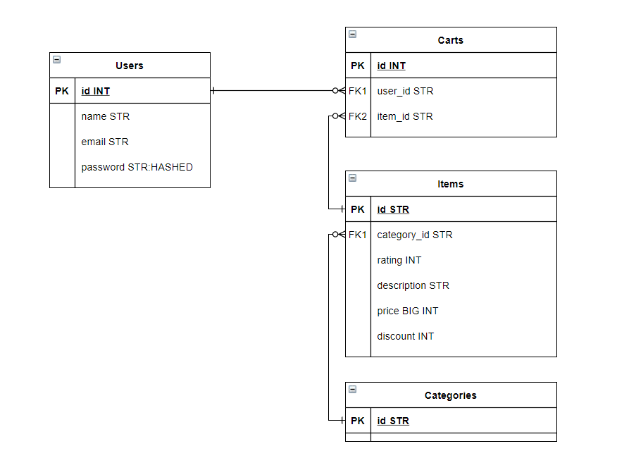

[![Contributors][contributors-shield]][contributors-url]
[![Forks][forks-shield]][forks-url]
[![Stargazers][stars-shield]][stars-url]
[![Issues][issues-shield]][issues-url]
[![MIT License][license-shield]][license-url]
[![LinkedIn][linkedin-shield]][linkedin-url]


<br />
<p align="center">
  <a href="https://github.com/astriddwrn/aksubFave-teamProject/">
    
  </a>

  <h3 align="center">Aksub Fave Mini Project: Fave Online Shop</h3>

</p>

### Built With

This section should list any major frameworks that you built your project using. Leave any add-ons/plugins for the acknowledgements section. Here are a few examples.
* [Bootstrap](https://getbootstrap.com)
* [JQuery](https://jquery.com)
* [Laravel](https://laravel.com)

### Prerequisites

This is an example of how to list things you need to use the software.
* XAMPP
* Composer

### Installation

1. Clone the repo
   ```sh
   git clone https://github.com/github_username/repo_name.git
   ```
2. Checkout BE Branch
   ```sh
   git checkout be
   ```
3. Change Directory to laravel
   ```sh
   cd laravel
   ```
4. Install composer
   ```sh
   composer install
   ```
5. Set up .env file
   ```sh
    DB_CONNECTION=mysql
    DB_HOST=127.0.0.1
    DB_PORT=3306
    DB_DATABASE=aksubfave-teamproject
    DB_USERNAME=root
    DB_PASSWORD=
   ``` 
6. Start XAMPP Apache and MySQL
7. Create new database in Phpmyadmin named "aksubfave-teamproject"
8. Laravel migrate
    ```sh
   php artisan migrate
   ```
9. Laravel seeder
    ```sh
    php artisan db:seed itemSeeder
    php artisan db:seed pictureSeeder
    php artisan db:seed categorySeeder
   ```
10. Run server
    ```sh
    php artisan serve
    ```
    
### ERD Database

